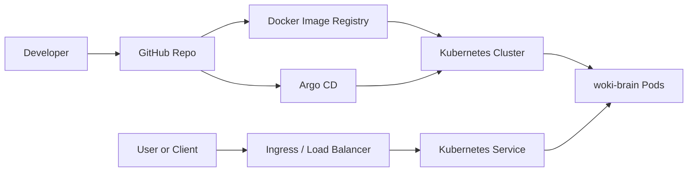

# infra-labs

Infrastructure labs for learning Kubernetes, AWS, Terraform, and GitOps.

The Kubernetes example application used in this repository is `woki-brain`, a Node.js API.

## Folders

```text
k8s-local/  Kubernetes manifests for Minikube
k8s-prod/   Kubernetes manifests for AWS EKS
gitops/     Terraform and Argo CD GitOps examples
```

## Goal

Use the same Kubernetes concepts in both environments:

- Namespace
- Deployment
- Service
- Ingress
- ConfigMap
- Health checks
- Horizontal Pod Autoscaler

Local Kubernetes is useful for learning and testing. AWS EKS adds cloud infrastructure such as load balancers, IAM, ECR, VPC networking, and production monitoring.

The GitOps folder adds infrastructure-as-code and continuous delivery examples:

- Terraform creates AWS infrastructure.
- Argo CD syncs Kubernetes manifests from Git into a cluster.

## Recommended Learning Path

1. Run the local version with Minikube.
2. Understand each manifest.
3. Build and publish a Docker image.
4. Review the Terraform EC2 example.
5. Review the Argo CD application example.
6. Replace the image in the production manifests.
7. Deploy to AWS EKS.

## Architecture Overview


