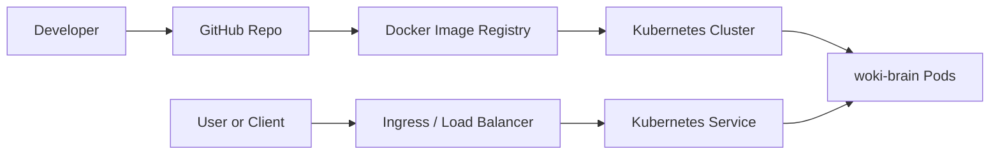

# k8s-labs

Kubernetes labs for learning how to run a backend API locally with Minikube and prepare a production-style deployment for AWS EKS.

The example application used in this repository is `woki-brain`, a Node.js API.

## Folders

```text
k8s-local/  Kubernetes manifests for Minikube
k8s-prod/   Kubernetes manifests for AWS EKS
```

## Goal

Use the same Kubernetes concepts in both environments:

- Namespace
- Deployment
- Service
- Ingress
- ConfigMap
- Health checks
- Horizontal Pod Autoscaler

Local Kubernetes is useful for learning and testing. AWS EKS adds cloud infrastructure such as load balancers, IAM, ECR, VPC networking, and production monitoring.

## Recommended Learning Path

1. Run the local version with Minikube.
2. Understand each manifest.
3. Build and publish a Docker image.
4. Replace the image in the production manifests.
5. Deploy to AWS EKS.

## Architecture Overview


