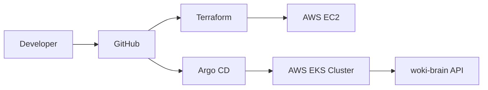

# gitops

GitOps examples for infrastructure and Kubernetes delivery.

This folder has two parts:

```text
terraform-aws-ec2/  Infrastructure as Code example with Terraform and AWS EC2
argocd/             Argo CD example that syncs Kubernetes manifests from Git
```

## Architecture



## What GitOps Means Here

Git is the source of truth.

- Terraform files describe AWS infrastructure.
- Argo CD files describe what Kubernetes should run.
- Changes are made by commits and pull requests.
- The deployed environment should match what is declared in Git.

## Recommended Order

1. Read `terraform-aws-ec2/README.md`.
2. Create a simple EC2 instance with Terraform.
3. Read `argocd/README.md`.
4. Install Argo CD in a Kubernetes cluster.
5. Point Argo CD to this repository.
6. Let Argo CD sync the Kubernetes manifests.

## Important

AWS resources can generate costs. Always run `terraform destroy` when you finish testing.
