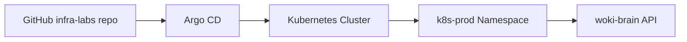

# argocd

Argo CD example for syncing Kubernetes manifests from Git into a Kubernetes cluster.

This example points Argo CD to the `k8s-prod` folder in this repository.

## Architecture



## Files

- `application.yaml`: Argo CD Application that watches the Git repo and syncs `k8s-prod`.

## Requirements

- Kubernetes cluster
- kubectl configured
- Argo CD installed

Install Argo CD:

```bash
kubectl create namespace argocd
kubectl apply -n argocd -f https://raw.githubusercontent.com/argoproj/argo-cd/stable/manifests/install.yaml
```

Apply the Argo CD application:

```bash
kubectl apply -f gitops/argocd/application.yaml
```

Check the application:

```bash
kubectl get applications -n argocd
```

## How It Works

1. Argo CD watches this GitHub repository.
2. It reads the manifests from `k8s-prod`.
3. It compares Git state with cluster state.
4. It syncs the cluster if something changed.

## Important

Before using this in a real AWS EKS cluster, update:

- Docker image in `k8s-prod/deployment.yaml`
- Domain and TLS settings in `k8s-prod/ingress.yaml`
- Secrets management
- AWS Load Balancer Controller setup
