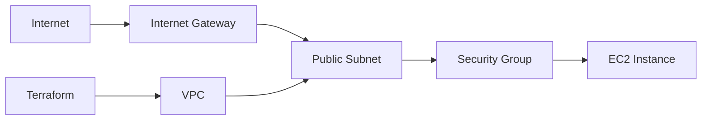

# terraform-aws-ec2

Terraform example that creates a simple EC2 instance in AWS.

This is a learning example for Infrastructure as Code. It creates:

- VPC
- Public subnet
- Internet gateway
- Route table
- Security group
- EC2 instance

## Architecture



## Requirements

- Terraform installed
- AWS CLI installed
- AWS credentials configured

Configure AWS credentials:

```bash
aws configure
```

## Files

- `versions.tf`: Terraform and provider version requirements.
- `variables.tf`: configurable input values.
- `main.tf`: AWS resources.
- `outputs.tf`: useful values printed after apply.
- `terraform.tfvars.example`: example variables file.

## How To Run

Copy the example variables file:

```bash
cp terraform.tfvars.example terraform.tfvars
```

Edit `terraform.tfvars` if needed.

Initialize Terraform:

```bash
terraform init
```

Preview changes:

```bash
terraform plan
```

Create resources:

```bash
terraform apply
```

Destroy resources when finished:

```bash
terraform destroy
```

## Notes

- This example uses the default Ubuntu AMI lookup for the selected region.
- SSH is restricted by `allowed_ssh_cidr`.
- HTTP is open on port `80` for demo purposes.
- For production, use stricter networking, IAM roles, monitoring, and patching.
