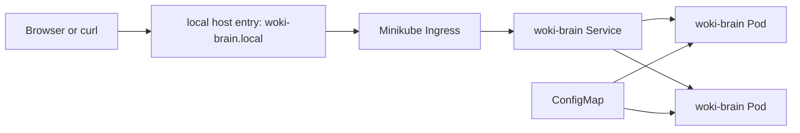

# k8s-local

Local Kubernetes setup for running the `woki-brain` API on Minikube.

This folder is designed for learning. It uses a local Kubernetes cluster, local DNS mapping, and a Minikube Ingress controller.

## Architecture



## Files

- `namespace.yaml`: creates an isolated namespace for the lab.
- `configmap.yaml`: stores non-secret app configuration.
- `deployment.yaml`: runs the API containers.
- `service.yaml`: exposes the pods inside the cluster.
- `ingress.yaml`: exposes the API through a local hostname.
- `hpa.yaml`: optional autoscaling example.

## Requirements

- Docker
- Minikube
- kubectl

## Steps

Start Minikube:

```bash
minikube start
```

Enable the Ingress addon:

```bash
minikube addons enable ingress
```

Apply the manifests:

```bash
kubectl apply -f k8s-local/*.yaml
```

Check the resources:

```bash
kubectl get all -n k8s-local
kubectl get ingress -n k8s-local
```

Add a local host entry:

```bash
echo "$(minikube ip) woki-brain.local" | sudo tee -a /etc/hosts
```

Test the API:

```bash
curl http://woki-brain.local/health
```

Open Swagger docs:

```text
http://woki-brain.local/docs
```

## Cleanup

```bash
kubectl delete -f k8s-local/*.yaml
```
