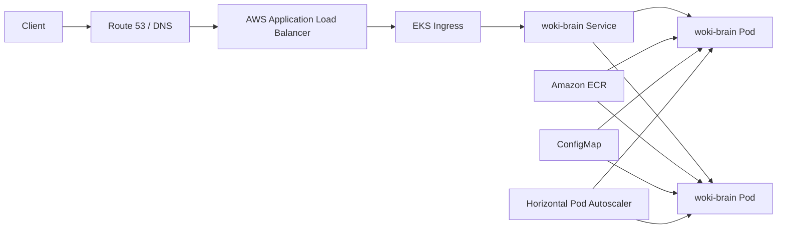

# k8s-prod

Production-style Kubernetes setup for running the `woki-brain` API on AWS EKS.

This folder is designed as a portfolio-ready starting point. It assumes you already have an EKS cluster, an image in a registry such as Amazon ECR, and the AWS Load Balancer Controller installed.

## Architecture



## Files

- `namespace.yaml`: creates the production namespace.
- `configmap.yaml`: stores non-secret runtime config.
- `deployment.yaml`: runs the API pods using a production image.
- `service.yaml`: exposes the app inside the cluster.
- `ingress.yaml`: creates an AWS ALB using AWS Load Balancer Controller.
- `hpa.yaml`: scales pods based on CPU usage.

## Requirements

- AWS account
- EKS cluster
- kubectl configured for the EKS cluster
- AWS CLI configured
- AWS Load Balancer Controller installed
- Docker image pushed to a registry, preferably Amazon ECR

## Suggested AWS Setup

Create or connect to your EKS cluster:

```bash
aws eks update-kubeconfig --region us-east-1 --name your-cluster-name
```

Confirm cluster access:

```bash
kubectl get nodes
```

Build and push your Docker image to ECR:

```bash
aws ecr create-repository --repository-name woki-brain
```

Then build, tag, and push the image. Replace the image in `deployment.yaml`:

```yaml
image: 123456789012.dkr.ecr.us-east-1.amazonaws.com/woki-brain:latest
```

Apply the manifests:

```bash
kubectl apply -f k8s-prod/*.yaml
```

Check the resources:

```bash
kubectl get all -n k8s-prod
kubectl get ingress -n k8s-prod
```

Wait for the ALB address:

```bash
kubectl describe ingress woki-brain -n k8s-prod
```

Test the API:

```bash
curl http://your-alb-dns-name/health
```

## Production Notes

- Use AWS Secrets Manager or Kubernetes Secrets for sensitive values.
- Use ECR instead of Docker Hub for private production images.
- Use Route 53 and ACM for a custom domain with HTTPS.
- Add monitoring with CloudWatch, Prometheus, or Grafana.
- Set resource requests and limits before enabling autoscaling.

## Cleanup

```bash
kubectl delete -f k8s-prod/*.yaml
```
